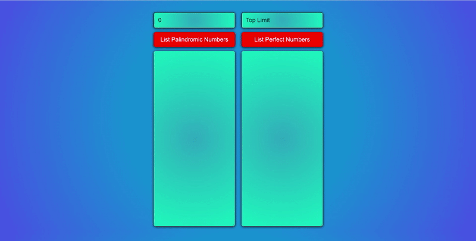

# list-palidromic-and-perfect-numbers

## Table of contents

- [Overview](#overview)
  - [The challenge](#the-challenge)
  - [Problem Statement](#problem-statement)
  - [Project Skeleton](#project-skeleton)
  - [Screenshot](#screenshot)
  - [Links](#links)
- [My process](#my-process)
  - [Built with](#built-with)


## Overview

### The challenge

The purpose of this project is to build a website that can list all palindrome and perfect numbers within the given range.


### Problem Statement

- Take one or two inputs from user. List the results in the relevant fields using two different buttons.

- Examples:

  - if top low limit is 0 and limit value is 1000. List all palindromic and perfect numbers between 0 and 1000.

  - if top low limit is 50 and limit value is 100. List all palindromic and perfect numbers between 50 and 100.
   
   
**What is the palindromic numbers?**
> A palindromic number (also known as a numeral palindrome or a numeric palindrome) is a number (such as 16461) that remains the same when its digits are reversed. In other words, it has reflectional symmetry across a vertical axis. The term palindromic is derived from palindrome, which refers to a word (such as rotor or racecar) whose spelling is unchanged when its letters are reversed. <br>
The first 30 palindromic numbers (in decimal) are:
0, 1, 2, 3, 4, 5, 6, 7, 8, 9, 11, 22, 33, 44, 55, 66, 77, 88, 99, 101, 111, 121, 131, 141, 151, 161, 171, 181, 191, 202, … [Wikipedia](https://en.wikipedia.org/wiki/Palindromic_number)<br>

**What is perfect numbers?**
> Perfect Number: In number theory, a perfect number is a positive integer that is equal to the sum of its positive divisors, excluding the number itself. For instance, 6 has divisors 1, 2 and 3, and 1 + 2 + 3 = 6, so 6 is a perfect number. [Wikipedia](https://en.wikipedia.org/wiki/Perfect_number)
   
   

### Project Skeleton

```
list-palidromic-and-perfect-numbers (folder)
        |----index.html 
        |----app.js
        
             
```

### Screenshot

<p align="center">
<a href="https://sezginakgul.github.io/list-palidromic-and-perfect-numbers/"></a>
</p>


### Links

- Live: [Live Website](https://sezginakgul.github.io/list-palidromic-and-perfect-numbers/)


### Built with

- Javascript DOM
- Javascript Events
- Javascript Functions
- Semantic HTML5 markup
- Internal CSS
- CSS custom properties
- Flexbox
- Mobile-first workflow
- Styled Components - For styles
- HTML Forms-Input Types
- CSS Colors-Border Properties
- CSS Margins-Padding
- CSS Properties for Texts-Font Families-Links
- CSS Opacity 
- Comments
